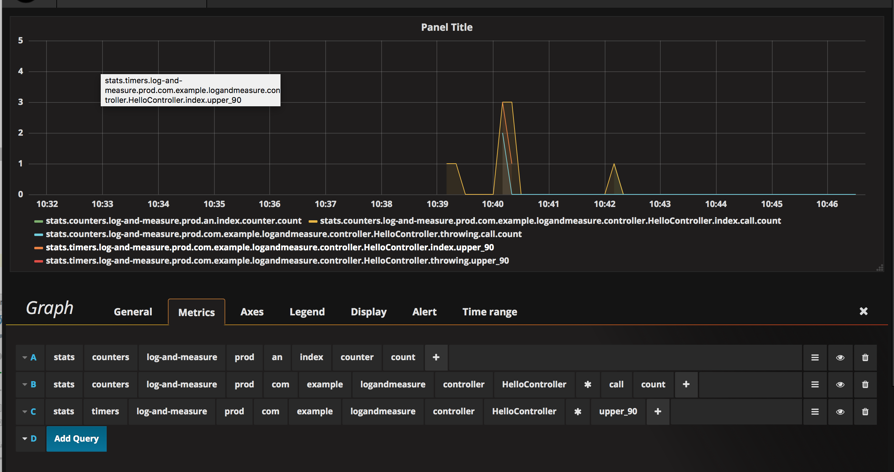
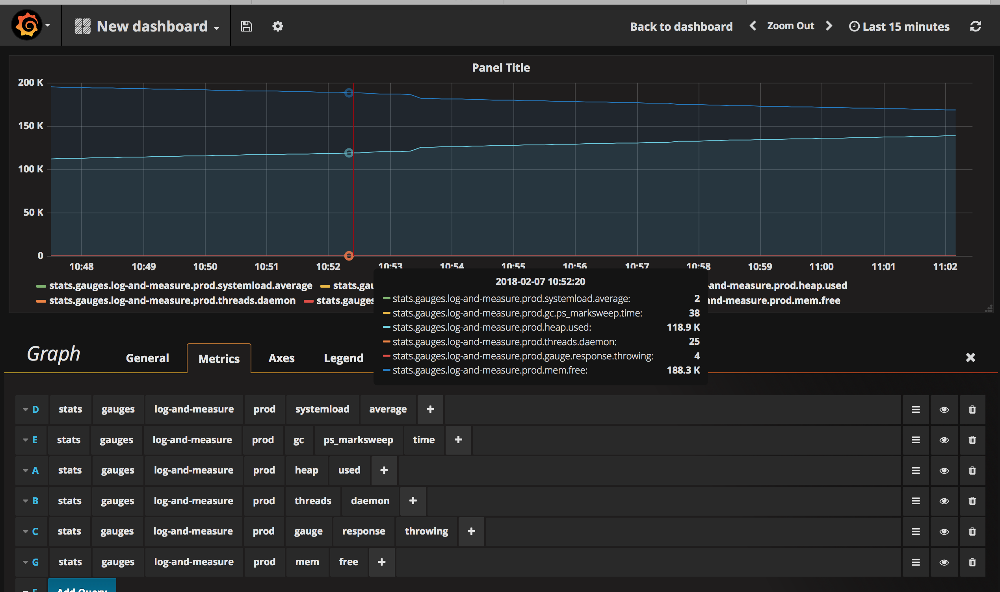

# Metrics, measures & logs for all

#### An oppinionated way of logging and measuring things with spring boot, actuator, aspect, logstash, statsd, graphite & graphana


## Logging

Spring boot's logging is already pretty trivial:

1) add the logging dependency in the pom.xml
```xml
<dependency>
    <groupId>org.springframework.boot</groupId>
    <artifactId>spring-boot-starter-logging</artifactId>
</dependency>
```

2) customize package/class logging levels by adding these properties in a application.properties (or yaml)
```properties
logging.level.root=INFO
logging.level.<package>=MY_LEVEL
logging.level.<class_FQDN>=MY_LEVEL
```

### But how do we log everything? - aspectj comes to the rescue

1. Add the aop dependency in the pom.xml
```xml
<dependency>
    <groupId>org.springframework.boot</groupId>
    <artifactId>spring-boot-starter-aop</artifactId>
</dependency>
```

2. Create some aspects around your sensitive methods (feel free to log method names, parameter names, processing time, etc):

```java
@Component
@Aspect
public class LoggingAspect {

    @Around("execution(public * *..service.*Service.*(..))")
    public Object aroundServiceMethod(ProceedingJoinPoint joinPoint) throws Throwable {
        return logAndReturn(joinPoint);
    }

    @Around("execution(public * *..controller.*..*Controller.*(..))")
    public Object aroundControllerMethod(ProceedingJoinPoint joinPoint) throws Throwable {
        return logAndReturn(joinPoint);
    }

    @Around("execution(public * *..repository.*Repository.*(..))")
    public Object aroundRepositoryMethod(ProceedingJoinPoint joinPoint) throws Throwable {
        return logAndReturn(joinPoint);
    }

...
}
```

_(For an example implementation of logAndReturn() please consult the github repo)_


_NB! If using lombok: Just annotate your class with @Slf4j to receive this field:_
```java
    private Logger log = LoggerFactory.getLogger(getClass());
```

example logs:
```
2018-02-07 10:42:12.600 DEBUG 55932 --- [nio-8080-exec-1] c.e.l.controller.HelloController         : we're serving a GET now
2018-02-07 10:42:12.609 DEBUG 55932 --- [nio-8080-exec-1] c.e.l.repository.MyRepository            : log from the repository
2018-02-07 10:42:12.609 DEBUG 55932 --- [nio-8080-exec-1] c.e.l.repository.MyRepository            : Object fetch([String@47c202af]) returned java.lang.Object@36f03505 [1ms]
2018-02-07 10:42:12.609 DEBUG 55932 --- [nio-8080-exec-1] c.e.logandmeasure.service.MyService      : service fetched: java.lang.Object@36f03505
2018-02-07 10:42:12.609 DEBUG 55932 --- [nio-8080-exec-1] c.e.logandmeasure.service.MyService      : void doWork([String@47c202af]) returned null [4ms]
...
2018-02-07 10:53:30.028 DEBUG 55932 --- [nio-8080-exec-4] c.e.l.controller.HelloController         : we're serving a GET now
2018-02-07 10:53:30.028 ERROR 55932 --- [nio-8080-exec-4] c.e.l.repository.MyRepository            : void throwing([String@47c202af]) threw RuntimeException(throwing an exception) [0ms]
2018-02-07 10:53:30.029 ERROR 55932 --- [nio-8080-exec-4] c.e.logandmeasure.service.MyService      : void doThrow([String@47c202af]) threw RuntimeException(throwing an exception) [0ms]
2018-02-07 10:53:30.042 ERROR 55932 --- [nio-8080-exec-4] o.a.c.c.C.[.[.[/].[dispatcherServlet]    : Servlet.service() for servlet [dispatcherServlet] in context with path [] threw exception [Request processing failed; nested exception is java.lang.RuntimeException: throwing an exception] with root cause
```

## Measure everything!

We can do application monitoring in many ways, but here we'll take a look on how we do it with actuator, statsd, graphite & grafana
1) Add the actuator dependency 
```xml
<dependency>
    <groupId>org.springframework.boot</groupId>
    <artifactId>spring-boot-starter-actuator</artifactId>
</dependency>
```

2) Teach spring boot submit to statsd

- Add the dependencies
```xml
<dependency>
    <groupId>com.timgroup</groupId>
    <artifactId>java-statsd-client</artifactId>
    <version>3.1.0</version>
</dependency>
```

- Configure the `statsd` client bean
```
    // can be found in MetricConfig
    @Bean
    public StatsDClient statsd() {
        log.debug("Using statsd on {}:{}", host, port);
        return new NonBlockingStatsDClient(prefix, host, port); // or NoOpStatsDClient instance if no metrics should be emitted in dev env or some other cases
    }
```

_NB! Prefix is good to be something related to the application itself, like `spring.application.name`.prod or .staging?_


- If we'd like to emit & measure the actuator metrics:
```java

    // can be found in MetricConfig
    @Bean
    public MetricsEndpointMetricReader metricsEndpointMetricReader(final MetricsEndpoint metricsEndpoint) {
        return new MetricsEndpointMetricReader(metricsEndpoint);
    }

    @Bean
    @ExportMetricWriter
    public MetricWriter statsdMetricWriter() {
        return new StatsdMetricWriter(prefix, host, port);
    }
```
these include a lot of useful metrics, like cpu usage, hdd usage, accumulates statistics for many spring internals, has an integration with `spring-feign` and maybe other spring cloud projects too


- We can create a helper class to emit some metics:
```java
@Component
@RequiredArgsConstructor(onConstructor = @__({@Autowired}))
public class Measure {

    private final StatsDClient statsd;

    public void call(ProceedingJoinPoint joinPoint) {
        statsd.increment(String.join(".", getName(joinPoint), "call"));
    }

    public void success(ProceedingJoinPoint joinPoint) {
        statsd.increment(String.join(".", getName(joinPoint), "success"));
    }

    public void error(ProceedingJoinPoint joinPoint, Throwable up) {
        statsd.increment(String.join(".", getName(joinPoint), "error", up.getClass().getSimpleName()));
    }

    public void time(ProceedingJoinPoint joinPoint, long start) {
        statsd.recordExecutionTimeToNow(getName(joinPoint), start);
    }

    public void time(String metric, long time) {
        statsd.time(metric, time);
    }

    public void inc(String metric) {
        statsd.increment(metric);
    }
}
```

3) Using similar concept as the logging aspect, we can make an automatic measure of all interesting methods:
```java
@Component
@Aspect
@RequiredArgsConstructor(onConstructor = @__({@Autowired}))
public class MetricAspect {

    private final Measure measure;

    @Around("execution(public * *..service.*Service.*(..))")
    public Object service(ProceedingJoinPoint joinPoint) throws Throwable {
        return metric(joinPoint);
    }

    @Around("execution(public * *..controller.*Controller.*(..))")
    public Object controller(ProceedingJoinPoint joinPoint) throws Throwable {
        return metric(joinPoint);
    }

    @Around("execution(public * *..repository.*Repository.*(..))")
    public Object controller(ProceedingJoinPoint joinPoint) throws Throwable {
        return metric(joinPoint);
    }

    private Object metric(ProceedingJoinPoint joinPoint) throws Throwable {
        final Object result;
        long start = System.currentTimeMillis();
        try {
            measure.call(joinPoint);
            result = joinPoint.proceed();
            measure.success(joinPoint);
        } catch (Throwable up) {
            measure.error( joinPoint, up);
            throw up;
        } finally {
            measure.time(joinPoint, start);
        }
        return result;
    }

}
```

_N.B! one can measure custom metrics by autowiring `Measure` and calling `measure.time(...)` or `measure.inc(...)`, etc_

3) installing statsd, graphite & grafana is trivial with https://github.com/kamon-io/docker-grafana-graphite
- the graphite can be found on http://localhost:81
- the grafana can be found on http://localhost:80 credentials are admin:admin

4) You can create useful dashboards around all the measured metrics



or even add some of the actuator measures:



